# MLB Pitch Prediction

## Final Presentation
https://youtu.be/F_gjot28Rvo

## How to Build and Run

To reproduce the results of this project, follow these steps:

1. **Clone the repository**  
   Run: `git clone https://github.com/justinzheng8/mlb-pitch-prediction.git` and then `cd mlb-pitch-prediction`.

2. **Create the environment**  
   This project uses Conda/Mamba for reproducibility. All dependencies are listed in `environment.yml`.  
   Run: `mamba env create -f environment.yml` and then `mamba activate mlb-pitch-prediction`.

3. **Run the pipeline**  
   Use the Makefile to install dependencies, build directories, execute notebooks, and run tests.  
   Run: `make setup` (installs environment and confirms setup), `make build` (creates necessary folders such as notebooks/plots), `make run` (executes notebooks and converts them to HTML in `notebooks/`), and `make test` (runs pytest suite to validate pipeline).  
   Tests are skipped automatically if the dataset is not available (e.g., in CI).

4. **Clean generated outputs**  
   Run: `make clean` to delete HTML, PNG, and PDF outputs.

### Environment Support
- Windows (tested with Miniconda and Mamba)  
- Python 3.10  
- Notebooks produce HTML reports in `notebooks/` when run with `make run`.  
- Tests validate pipeline steps and skip automatically if dataset is missing (e.g., in CI).

---

## Project Overview

This project applies the full data science lifecycle to predict pitch types in Major League Baseball using the 2023 Statcast dataset. The dataset contains **720,684 pitches** with **118 columns** of information, including velocity, spin, release position, game context, and batter/pitcher handedness. Data was collected using the `pybaseball` library, covering the 2023 MLB regular season (March 30 – October 1).

**Goal:** Build a reproducible pipeline that collects, cleans, explores, and models Statcast data to predict pitch type.  
**Scope:** Covers data collection, cleaning, feature engineering, visualization, model training, and evaluation.  
**Final Model:** A **weighted XGBoost classifier** that achieves **93.3% accuracy** and **macro F1 = 0.873** across all 17 pitch types. This choice balances overall accuracy with fairness across classes, ensuring rare pitches (e.g., knuckleballs, screwballs, pickoffs) are represented without collapsing them into an “Other” category.

---

## Key Contributions

- **Data Collection & Cleaning:**  
  - Loaded Statcast 2023 CSV via `pybaseball`.  
  - Verified 720k rows, handled missing values, dropped deprecated fields.  
  - Cached dataset in `notebooks/data/statcast_2023.csv` for reproducibility.  

- **Exploration:**  
  - Visualized pitch distributions, release speeds, positional data, and contextual factors (count, inning, outs, handedness).  
  - Fastballs (FF) accounted for ~32% of all pitches, sliders (SL) ~16%, and sinkers (SI) ~15%.  
  - Produced histograms, correlation heatmaps, and scatter plots to validate feature behavior.  

- **Feature Engineering:**  
  - Added sequencing (`prev_pitch_type`), game context (`score_diff`, `runner_on`, `count_pressure`), and situational flags (`two_strikes`).  
  - Created categorical `count` feature (balls‑strikes string).  
  - Expanded dataset from 118 → 125 columns.  

- **Modeling:**  
  - **Logistic Regression:** 65% accuracy, macro F1 = 0.46.  
  - **Neural Net (Keras):** 89.6% accuracy, macro F1 = 0.73.  
  - **Tuned XGBoost:** 93.7% accuracy, macro F1 = 0.84.  
  - **Weighted XGBoost (final choice):** 93.3% accuracy, macro F1 = 0.873.  

- **Results:**  
  - Confusion matrices confirm strong separation for common pitches, weaker but still represented for rare types.  
  - Per‑class F1 scores show most classes near 0.9–1.0, with rare pitches lower (e.g., PO ~0.33).  
  - Feature importance highlights sequencing (previous pitch type), spin rate, and velocity as top predictors.  

---

## Reproducibility & Testing

- **Environment:** All dependencies pinned in `environment.yml`.  
- **Automation:** Makefile targets (`setup`, `build`, `run`, `test`, `clean`).  
- **Testing:** Pytest suite validates data availability, feature engineering, and model training.  
- **CI/CD:** GitHub Actions workflow runs tests automatically on push.  

---

## Data Collection & Cleaning

### Data Source
The dataset was collected using the `pybaseball` library, which provides direct access to MLB’s Statcast system. We downloaded all pitches from the **2023 regular season (March 30 – October 1)**, resulting in **720,684 rows** and **118 columns** of information. The raw dataset includes velocity, spin, release position, plate location, game context, and categorical identifiers such as batter and pitcher handedness.

### Cleaning Steps
- **Removed deprecated fields:** Columns such as `spin_rate_deprecated`, `break_angle_deprecated`, and `tfs_zulu_deprecated` were dropped.  
- **Handled missing values:** Columns with excessive missingness (`sv_id`, `umpire`, `spin_dir`) were excluded from modeling. Other missing values were imputed or flagged depending on context.  
- **Normalized column names:** Whitespace stripped, categorical values standardized.  
- **Sanity checks:** Verified row and column counts, inspected sample rows, confirmed expected pitch types.  
- **Caching:** Saved dataset locally in `notebooks/data/statcast_2023.csv` to ensure reproducibility across environments.

### Validation
To confirm the dataset was internally consistent and ready for modeling, we produced exploratory plots:

 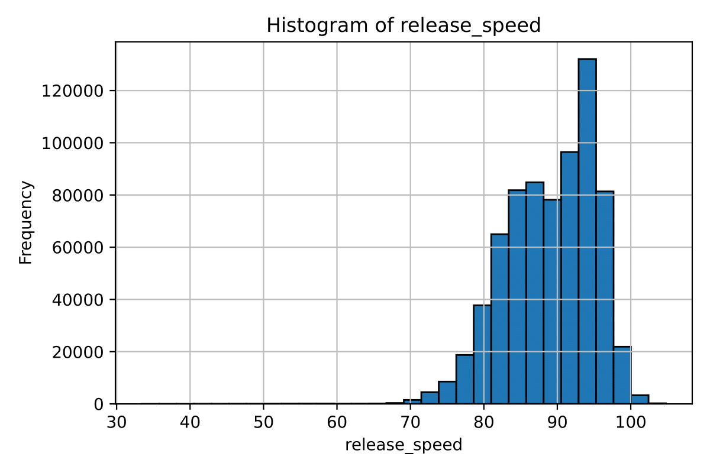 
 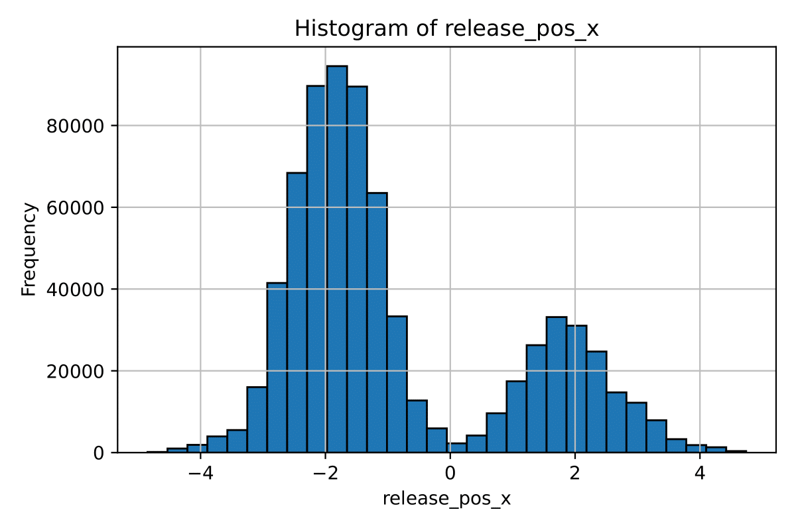
 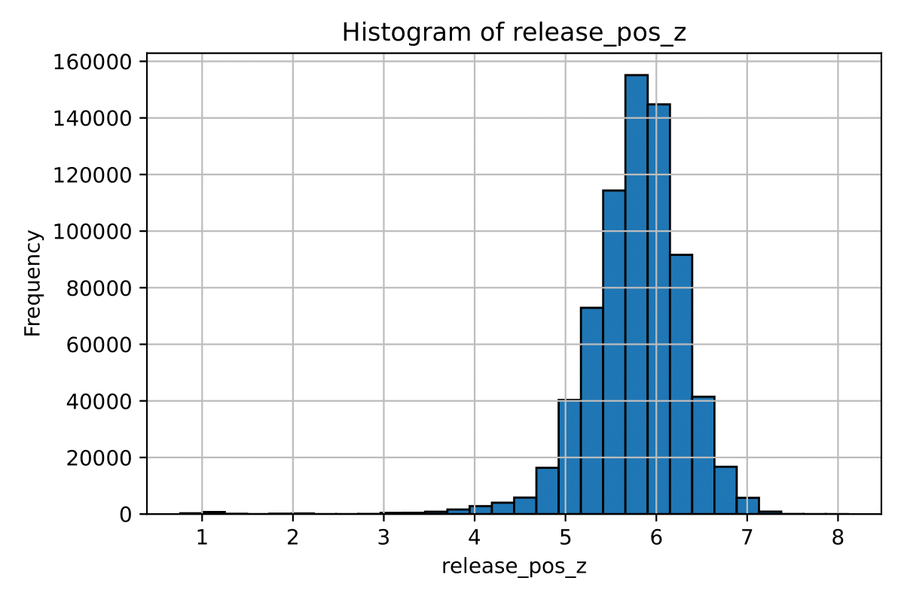
 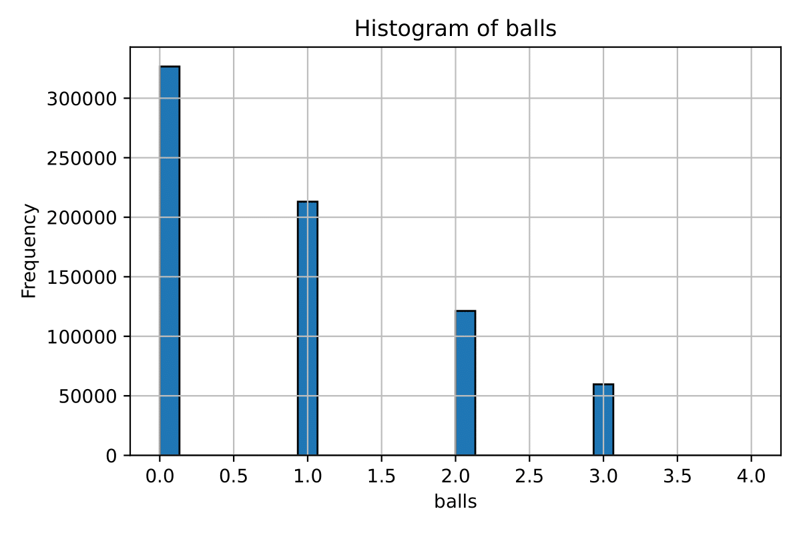
 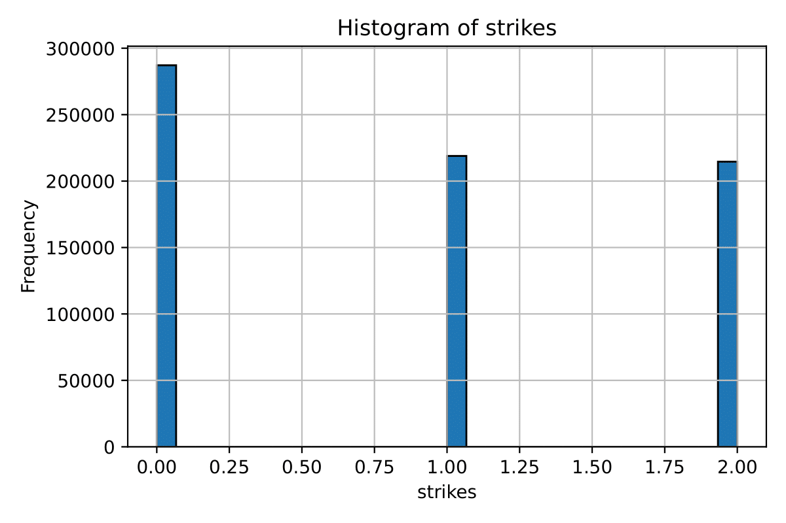
 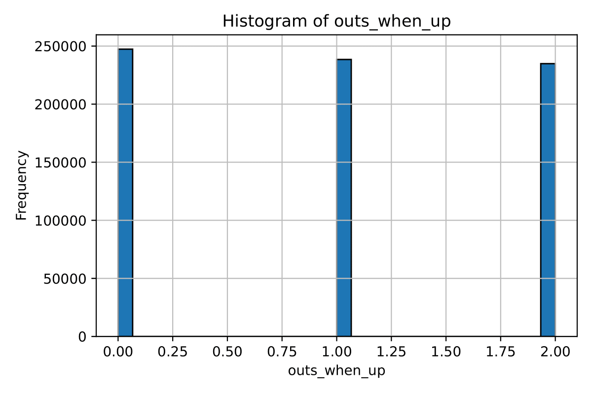
 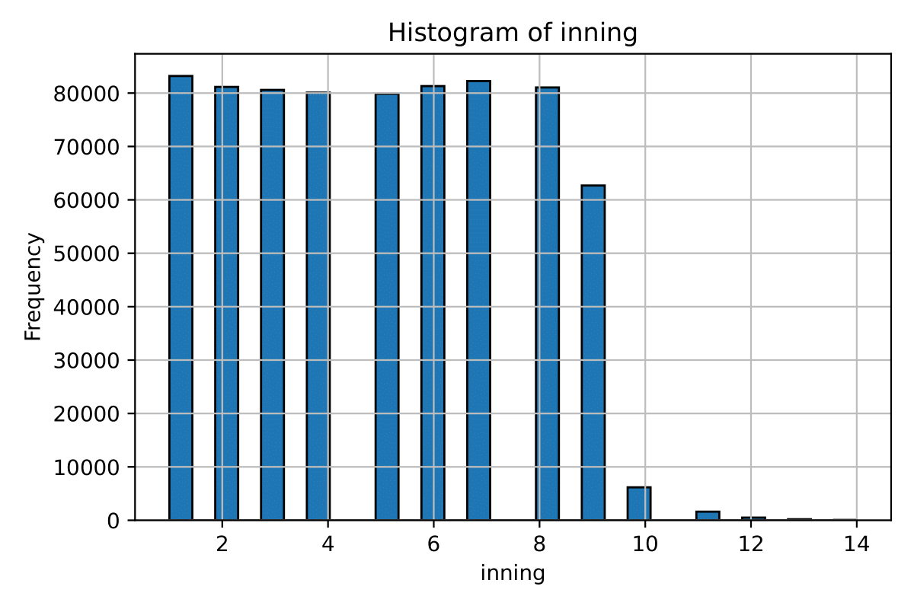

Plots showing distributions of release speed, release position (X, Z), balls, strikes, outs, and inning.  

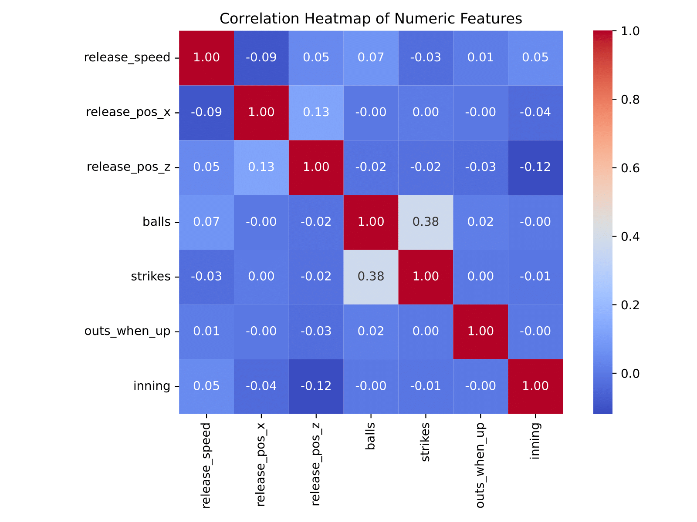

Correlation matrix of numeric features, showing moderate correlation between balls and strikes, weak correlation between release speed and release position.  

These checks validated that the dataset was complete, balanced across contextual features, and suitable for feature engineering and model training.

---

## Exploratory Data Analysis (EDA)

Exploratory analysis was performed to understand pitch distributions, numeric feature behavior, and contextual influences on pitch selection.

### Pitch Distributions
- Fastballs (FF) dominate the dataset, making up ~32% of all pitches.
- Sliders (SL ~16%) and sinkers (SI ~15%) are the next most common.
- Rare pitches such as knuckleballs (KN), screwballs (SC), and pickoffs (PO) appear fewer than 200 times.
- This confirms a strong class imbalance that must be addressed in modeling.

### Numeric Features
- **Release speed:** Median ~89.8 mph, range 33–105 mph.  
- **Release position (X):** Bimodal distribution, reflecting left‑ vs. right‑handed pitchers.  
- **Release position (Z):** Tight clustering around 5.8 ft, consistent with shoulder‑height release.  
- **Balls/strikes:** Discrete distributions with peaks at common counts (0‑0, 1‑1, 2‑2).  
- **Outs/inning:** Even distribution across outs; innings 1–9 show declining frequency due to pitcher substitutions.

### Contextual Factors
- **Batter handedness:** Right‑handed batters see more sliders and sinkers; left‑handed batters more changeups and cutters.  
- **Pitcher handedness:** Left‑handed pitchers throw more changeups and sinkers; right‑handed pitchers more sliders and splitters.  
- **Count:**  
  - Off‑speed pitches increase in two‑strike counts (e.g., sliders, curveballs, splitters).  
  - Fastball usage spikes in three‑ball counts, especially 3‑2, to avoid walks.  
- **Inning:** Fastballs most common early (inning 1), sliders and sinkers increase later.  
- **Outs:** Sliders and curveballs slightly more frequent with two outs, often used to induce strikeouts.

Plots:  
 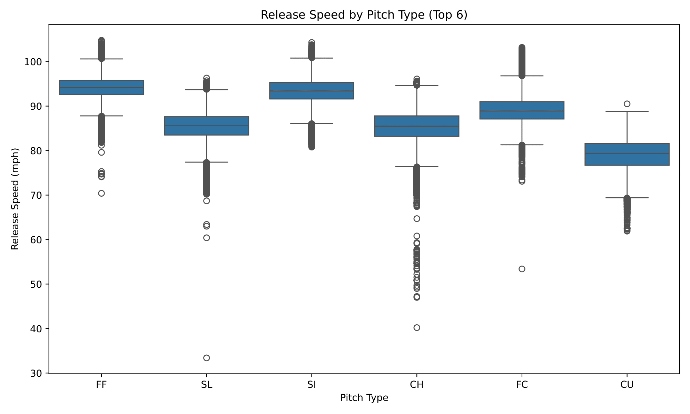  
 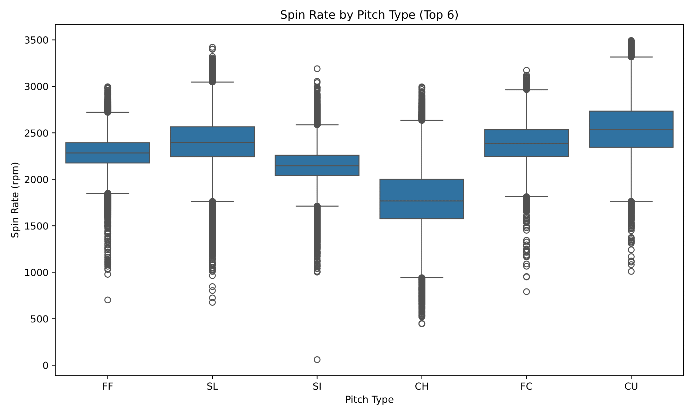   
 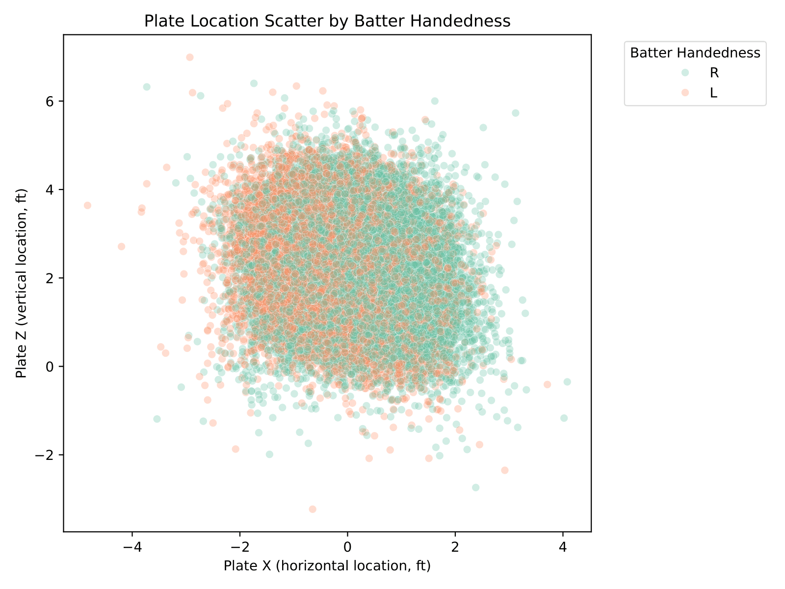 
 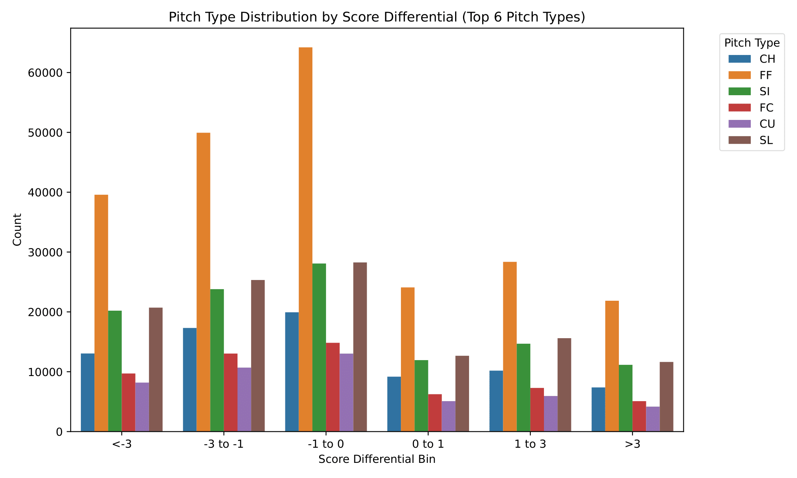 

### Key Insights
- Fastballs dominate early counts and innings; off‑speed pitches increase in high‑pressure situations.  
- Release speed, spin rate, and positional features show strong separation potential across pitch types.  
- Contextual features (count, inning, outs, handedness) provide situational nuance that complements physical measurements.

---

## Feature Engineering

To improve predictive performance beyond raw Statcast variables, several engineered features were added. These features capture sequencing, game context, and situational pressure that influence pitch selection.

### Sequencing Features
- **Previous pitch type (`prev_pitch_type`):** Tracks the type of pitch thrown immediately before the current one.  
- **Same pitcher/game flag (`same_pitcher_game`):** Ensures sequencing is only applied within the same pitcher and game context.

### Game Context Features
- **Score differential (`score_diff`):** Difference between home and away team scores at the time of the pitch.  
- **Runner presence (`runner_on`):** Binary indicator for whether any base runner was present.  
- **Count pressure (`count_pressure`):** Difference between balls and strikes, capturing leverage situations.  
- **Two‑strike flag (`two_strikes`):** Binary indicator for whether the batter was facing two strikes.

### Count Feature
- **Count string (`count`):** Concatenation of balls and strikes (e.g., “1‑2”, “3‑2”), treated as categorical.

### Dataset Expansion
- Original dataset: **118 columns**.  
- After feature engineering: **125 columns**.  
- Numeric features: release speed, release position (X, Z), plate location, spin rate, movement (`pfx_x`, `pfx_z`), plus engineered metrics (`score_diff`, `count_pressure`).  
- Categorical features: batter handedness (`stand`), pitcher handedness (`p_throws`), count string, inning, outs, previous pitch type, runner presence, two‑strike flag.

### Validation
Feature engineering was confirmed by inspecting sample rows and verifying correct alignment with target labels. The engineered dataset was then used for model training and evaluation.

---

## Modeling & Results

We evaluated multiple models to predict pitch type, progressing from a simple baseline to more advanced approaches. Each model was trained on the engineered dataset (125 features) and evaluated on a stratified test set of ~133k pitches.

### Baseline Logistic Regression
- Accuracy: **65.0%**
- Macro F1: **0.491**
- Strengths: Simple, interpretable.
- Limitations: Struggled with class imbalance and nonlinear relationships.
- Classification report showed poor performance on rare pitch types (e.g., PO, SC, CS).

### Neural Network (Keras)
- Accuracy: **89.7%**
- Macro F1: **0.742**
- Architecture: Two dense hidden layers (256 → 128 units) with dropout, softmax output.
- Strengths: Captured nonlinearities and improved performance over logistic regression.
- Limitations: Still weaker on rare classes compared to tree‑based methods.

### Tuned XGBoost
- Accuracy: **93.0%**
- Macro F1: **0.841**
- Hyperparameters: 300 estimators, learning rate 0.1, max depth 8, subsample 0.8.
- Strengths: Robust to imbalance, interpretable feature importance.
- Limitations: Slightly lower fairness across rare pitch types.

### Final Weighted XGBoost (Chosen Model)
- Accuracy: **93.3%**
- Macro F1: **0.873**
- Balanced performance across all 17 pitch types, ensuring rare pitches were represented.
- Key predictors included sequencing (`prev_pitch_type`), spin rate, release speed, and positional features.

### Visual Results
 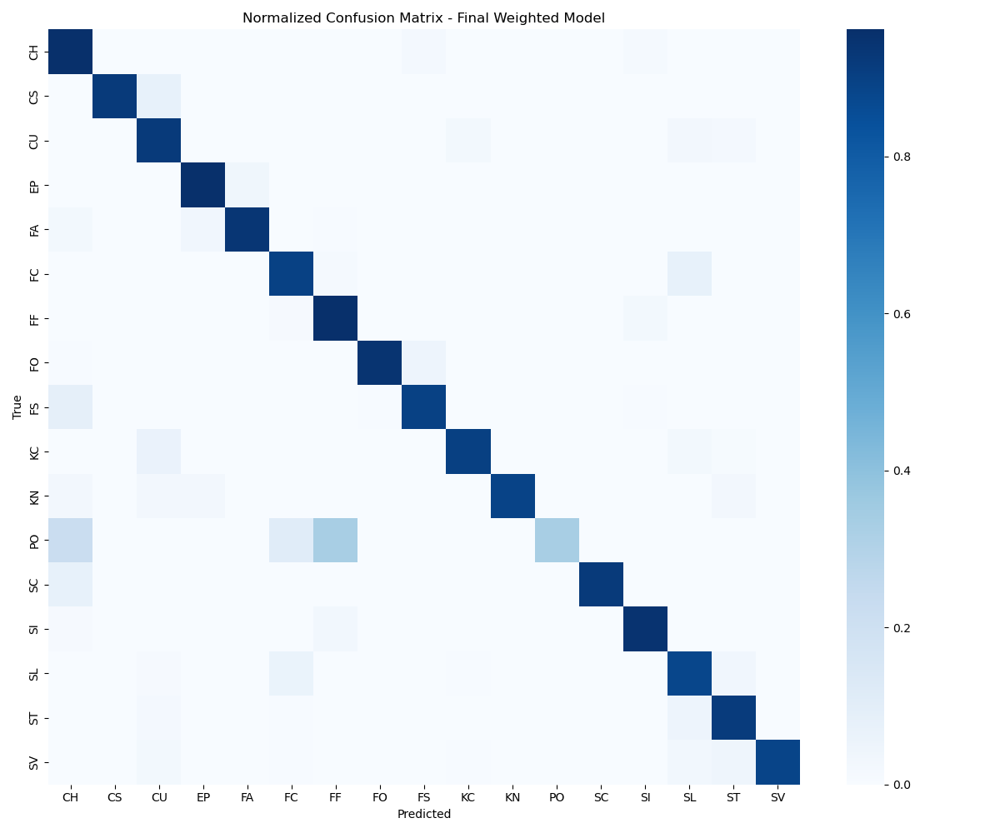 

Shows strong diagonal concentration, confirming accurate predictions for common pitches, with rare classes still represented.  
 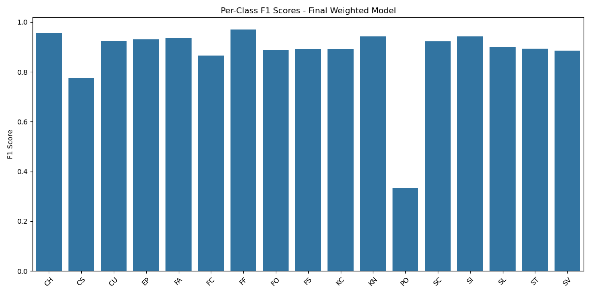 

Most classes near 0.9–1.0 F1; rare pitches lower (e.g., PO ~0.33).  
 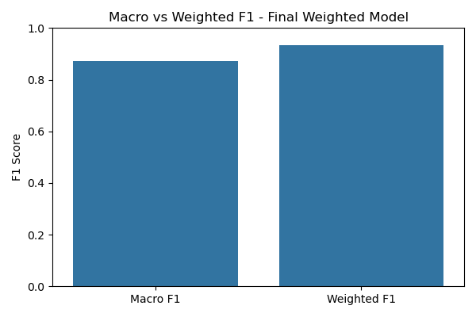 

Demonstrates fairness across classes (macro F1) and overall performance (weighted F1).  
  

Highlights sequencing (previous pitch type), spin rate, and release speed as top predictors.

### Key Insights
- Logistic Regression provided a baseline but was insufficient for complex, imbalanced data.  
- Neural Networks improved accuracy but underperformed on rare classes.  
- XGBoost offered the best balance of accuracy, interpretability, and fairness.  
- Weighted XGBoost was selected as the final model because it maintained high accuracy while ensuring rare pitch types were not ignored.

---

## Conclusion

This project demonstrates the full data science lifecycle applied to Major League Baseball pitch prediction. Starting from raw Statcast data collected via `pybaseball`, we cleaned and validated a dataset of **720,684 pitches** with **118 columns**, engineered contextual and sequencing features to expand it to **125 columns**, and evaluated multiple models. 

Key outcomes:
- **Baseline Logistic Regression** provided a simple benchmark but struggled with nonlinear relationships and rare pitch types.  
- **Neural Networks** improved accuracy but underperformed on minority classes.  
- **XGBoost** delivered strong overall accuracy and interpretability.  
- **Weighted XGBoost (final model)** achieved **93.3% accuracy** and **macro F1 = 0.873**, balancing performance across all 17 pitch types, including rare ones such as knuckleballs and pickoffs.  

The analysis confirmed baseball intuition: fastballs dominate early counts and innings, while sliders, curveballs, and splitters are favored in two‑strike or high‑pressure situations. Feature importance highlighted sequencing (previous pitch type), spin rate, and release speed as the most influential predictors.

Reproducibility was ensured through:
- **Environment management** with Conda/Mamba (`environment.yml`).  
- **Automation** via Makefile targets (`setup`, `build`, `run`, `test`, `clean`).  
- **Testing** with Pytest to validate data loading, feature engineering, and model training.  
- **CI/CD** using GitHub Actions to run tests automatically on push.  

Overall, this project achieved its goal of building a reproducible pipeline that predicts MLB pitch types with high accuracy and fairness. Future extensions could include multi‑season datasets for temporal generalization, player‑specific features (fatigue, repertoire), or deployment as an interactive dashboard for coaches and analysts.

---

## Contributing

Contributions are welcome! To propose changes:

1. Fork the repository.
2. Create a new branch for your feature or fix.
3. Commit your changes with clear messages.
4. Open a pull request describing your updates.

Issues can also be opened for bug reports or feature requests.
